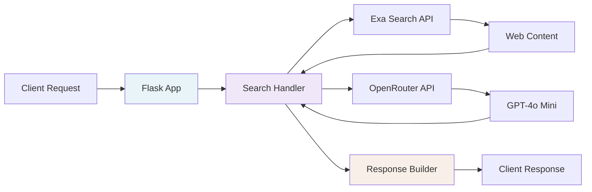

# AI Service

Python Flask service providing AI-powered search functionality for the Quantize platform using OpenRouter API with GPT-4o Mini and Exa search.

## Overview

The AI service is a microservice that handles:
- AI-powered search queries
- Web content retrieval and synthesis
- Related search suggestions
- Citation management
- Multiple LLM support

## Architecture



## Features

- **AI-Powered Search**: Uses GPT-4o Mini via OpenRouter for intelligent search responses
- **Web Integration**: Real-time web search using Exa API
- **Search Suggestions**: Generates 5 related search queries based on the original query
- **Multi-Model Support**: Supports multiple LLM models (GPT-4o Mini, Gemini 2.5 Flash, etc.)
- **Citation Tracking**: Automatically includes citations in responses
- **Health Monitoring**: Built-in health check endpoint
- **CORS Enabled**: Cross-origin requests supported

## Setup

### Local Development

1. **Create Virtual Environment**:
   ```bash
   cd packages/ai-service
   python3 -m venv venv
   source venv/bin/activate  # On Windows: venv\Scripts\activate
   ```

2. **Install Dependencies**:
   ```bash
   pip install -r requirements.txt
   ```

3. **Configure Environment**:
   ```bash
   cp .env.example .env
   # Edit .env and add your API keys:
   # OPENROUTER_API_KEY=your_key_here
   # EXA_API_KEY=your_key_here
   ```

4. **Start the Service**:
   ```bash
   python app.py
   ```
   
   The service will be available at `http://localhost:5002`

### Docker

```bash
# Build
docker build -t quantize-ai-service .

# Run
docker run -p 5002:5002 \
  -e OPENROUTER_API_KEY=your_key \
  -e EXA_API_KEY=your_key \
  quantize-ai-service
```

### Docker Compose

```bash
# From project root
docker-compose up ai-service
```

## API Endpoints

### POST /search
Performs AI-powered search for AI tools and startups.

**Request**:
```json
{
  "query": "AI tools for content creation",
  "context": {
    "budget": "$100/month",
    "company_size": "startup",
    "industry": "marketing"
  }
}
```

**Response**:
```json
{
  "query": "AI tools for content creation",
  "response": "Based on your requirements...",
  "suggestions": [
    "Best AI writing tools for marketing teams",
    "Free content creation AI tools",
    "AI video editing tools for startups",
    "Social media AI automation tools",
    "AI graphic design tools under $100"
  ],
  "model_used": "openai/gpt-4o-mini",
  "success": true
}
```

### GET /health
Health check endpoint to verify the service is running.

**Response**:
```json
{
  "status": "healthy",
  "model": "openai/gpt-4o-mini",
  "api_key_configured": true,
  "success": true
}
```

## System Prompt

The system prompt is clearly defined in `config.py`:

```python
SYSTEM_PROMPT = """You are an AI assistant specialized in finding and recommending AI tools, startups, and solutions. Your role is to help users discover the perfect AI products for their specific needs.

INSTRUCTIONS:
1. Analyze the user's query to understand their requirements, budget, use case, and preferences
2. Provide detailed, actionable recommendations for AI tools/startups that match their needs
3. Include specific details like pricing, features, target audience, and use cases
4. Format your response as a comprehensive analysis with clear sections
5. Be specific about why each recommendation fits their requirements
6. Consider factors like company size, technical expertise, budget constraints, and industry

RESPONSE FORMAT:
- Start with a brief summary of their needs
- Provide 3-5 specific tool/startup recommendations
- Include pricing, key features, and target audience for each
- End with implementation advice or next steps

Keep responses informative, practical, and focused on actionable recommendations."""
```

## Configuration

All configuration is in `config.py`:

- **OpenRouter API**: Uses GPT-4o Mini model
- **Flask Settings**: Runs on localhost:5001 by default
- **System Prompt**: Fully visible and customizable

## Integration

The AI service integrates with the main Node.js application:

1. Node.js server calls the Python AI service at `http://localhost:5001/search`
2. If AI service fails, falls back to traditional search
3. Results are displayed in a Perplexity-like UI with cascading search functionality

## Development

- **Logging**: Built-in logging for debugging
- **Error Handling**: Comprehensive error handling with fallbacks
- **CORS**: Enabled for cross-origin requests
- **Health Monitoring**: Health check endpoint for monitoring