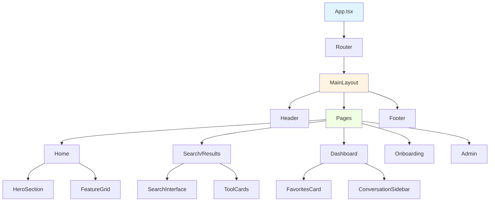
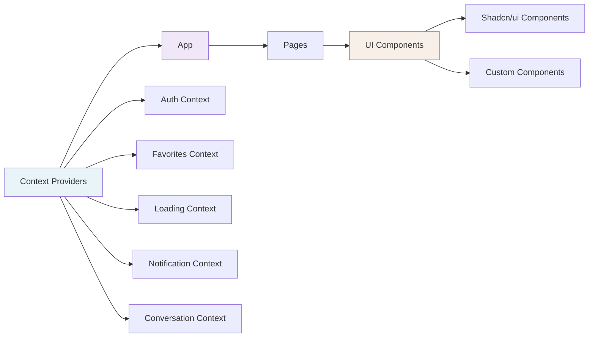
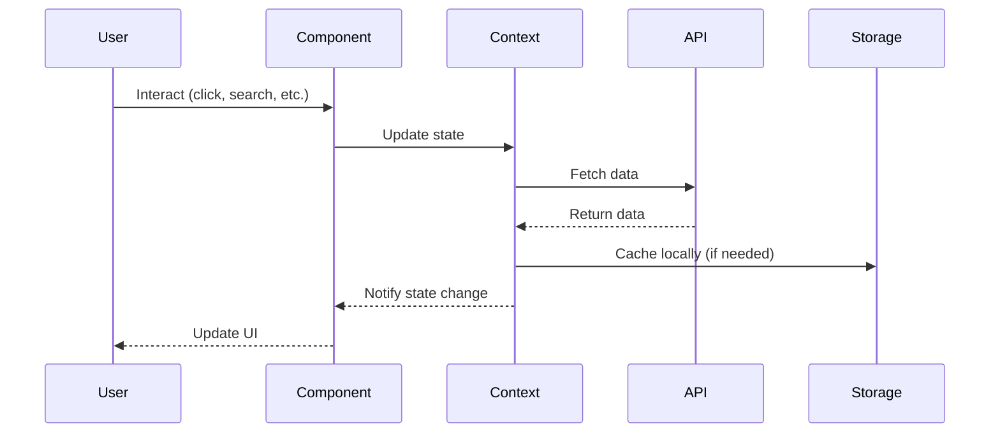

# Client Package

Modern React frontend application for the Quantize AI tool discovery platform.

## Overview

The client package is a React application built with TypeScript, Vite, and TailwindCSS, providing an intuitive interface for discovering and exploring AI tools from Indian companies.

## Architecture

### High-Level Component Structure



### Component Hierarchy



### State Management Flow



## Key Features

### 1. AI-Powered Search
- Real-time search with AI responses
- Cascading search results
- Related query suggestions
- Citation tracking

### 2. Authentication
- Firebase Authentication
- Google Sign-In
- Protected routes
- User session management

### 3. Tool Discovery
- Browse AI tools by category
- Filter by industry, pricing, features
- Detailed tool pages
- Click tracking and analytics

### 4. User Features
- Favorites management
- Conversation history
- Personalized dashboard
- Tool submission (onboarding)

### 5. Admin Panel
- Tool approval workflow
- Analytics dashboard
- User management
- Waitlist administration

## Directory Structure

```
client/
├── public/              # Static assets
│   ├── quantizenobg.png
│   ├── applogo.png
│   └── forest.png
├── src/
│   ├── components/      # Reusable components
│   │   ├── ui/          # Shadcn/ui components
│   │   ├── layout/      # Layout components
│   │   └── *.tsx        # Feature components
│   ├── contexts/        # React Context providers
│   ├── hooks/           # Custom React hooks
│   ├── layouts/         # Page layouts
│   ├── lib/             # Utilities and helpers
│   ├── pages/           # Route pages
│   ├── sections/        # Page sections
│   ├── services/        # API services
│   ├── styles/          # Global styles
│   ├── types/           # TypeScript types
│   ├── utils/           # Utility functions
│   ├── App.tsx          # App component
│   ├── main.tsx         # Entry point
│   └── index.css        # Global styles
├── index.html           # HTML template
└── README.md            # This file
```

## Core Components

### Layout Components

#### `MainLayout`
Main application layout with header, content area, and footer:
```tsx
<MainLayout>
  <Header />
  <main>{children}</main>
  <Footer />
</MainLayout>
```

#### `Header`
Navigation header with:
- Logo and branding
- Navigation links
- User authentication status
- Search trigger

#### `Footer`
Application footer with:
- Links and information
- Optional "Join Us" section
- Social media links

### Feature Components

#### `SearchInterface`
AI-powered search component:
- Voice input support
- Real-time suggestions
- Result display with citations
- Related queries

#### `ToolCard`
Displays AI tool information:
- Tool name and logo
- Description and features
- Pricing information
- Quick actions (favorite, visit)

#### `OnboardingForm`
Multi-step form for tool submission:
- Profile selection
- Product details
- Pricing and access
- Media and links
- Verification

### Context Providers

#### `FirebaseAuthContext`
Manages Firebase authentication:
```tsx
const { user, loading, signIn, signOut } = useAuth();
```

#### `FavoritesContext`
Manages user favorites:
```tsx
const { favorites, addFavorite, removeFavorite } = useFavorites();
```

#### `ConversationContext`
Manages search/conversation history:
```tsx
const { conversations, addMessage, clearHistory } = useConversation();
```

## UI Component Library

Built on Shadcn/ui with customizations:

### Core Components
- `Button` - Various button styles and variants
- `Card` - Content containers
- `Dialog` - Modal dialogs
- `Input` - Form inputs
- `Select` - Dropdowns
- `Toast` - Notifications
- `Tabs` - Tabbed interfaces

### Custom Animated Components
- `AnimatedButton` - Button with hover effects
- `AnimatedCard` - Card with entrance animations
- `AnimatedInput` - Input with focus animations
- `AnimatedSearchBar` - Search bar with transitions

### Data Display
- `Table` - Data tables
- `Chart` - Charts using Recharts
- `Badge` - Status badges
- `Avatar` - User avatars

## Routing

Using `wouter` for lightweight routing:

```tsx
<Route path="/" component={Home} />
<Route path="/search" component={SearchTransition} />
<Route path="/results" component={Results} />
<Route path="/dashboard" component={Dashboard} />
<Route path="/onboarding" component={Onboarding} />
<Route path="/admin" component={Admin} />
```

## State Management

### React Context API
Used for global state:
- Authentication state
- User preferences
- Favorites
- Conversations
- Notifications

### React Query
For server state management:
- API data fetching
- Caching
- Automatic refetching
- Optimistic updates

### Local State
Component-level state with `useState` and `useReducer`

## Styling

### TailwindCSS
Utility-first CSS framework with custom configuration:
- Custom color palette
- Typography scales
- Animation utilities
- Responsive breakpoints

### CSS Modules
For component-specific styles:
```tsx
import styles from './Component.module.css';
```

### Animations
- Framer Motion for complex animations
- CSS transitions for simple effects
- GSAP for scroll animations

## API Integration

### Service Layer

```typescript
// services/products.ts
export const searchTools = async (query: string) => {
  const response = await fetch('/api/search', {
    method: 'POST',
    body: JSON.stringify({ query })
  });
  return response.json();
};
```

### React Query Hooks

```typescript
const { data, isLoading, error } = useQuery({
  queryKey: ['tools', filters],
  queryFn: () => fetchTools(filters)
});
```

## Development

### Running Locally

```bash
# From project root
yarn dev
```

Access at: http://localhost:3001

### Building

```bash
# From project root
yarn build
```

Output: `dist/public/`

### Type Checking

```bash
yarn check
```

## Environment Variables

The client uses environment variables for configuration:

```env
VITE_FIREBASE_API_KEY=...
VITE_FIREBASE_AUTH_DOMAIN=...
VITE_FIREBASE_PROJECT_ID=...
```

## Performance Optimization

### Code Splitting
```typescript
const Admin = lazy(() => import('./pages/admin'));
```

### Image Optimization
- WebP format for images
- Lazy loading with `loading="lazy"`
- Responsive images

### Bundle Size
- Tree shaking enabled
- Dynamic imports for routes
- Vendor chunk splitting

## Accessibility

- Semantic HTML elements
- ARIA attributes where needed
- Keyboard navigation support
- Screen reader friendly
- Focus management

## Testing

```bash
# Run tests
yarn test

# Coverage
yarn test:coverage
```

## Component Development Guidelines

### Creating New Components

1. **Use TypeScript**
   ```tsx
   interface Props {
     title: string;
     onAction?: () => void;
   }
   
   export function MyComponent({ title, onAction }: Props) {
     // Implementation
   }
   ```

2. **Follow naming conventions**
   - PascalCase for components
   - camelCase for functions/variables
   - UPPER_CASE for constants

3. **Use composition**
   ```tsx
   <Card>
     <CardHeader>
       <CardTitle>{title}</CardTitle>
     </CardHeader>
     <CardContent>{children}</CardContent>
   </Card>
   ```

4. **Add prop types documentation**
   ```tsx
   /**
    * Displays a tool card with actions
    * @param tool - The tool object to display
    * @param onFavorite - Callback when favorited
    */
   export function ToolCard({ tool, onFavorite }: ToolCardProps) {
   ```

### Styling Best Practices

1. Use Tailwind utilities first
2. Create custom components for repeated patterns
3. Use CSS modules for complex styles
4. Maintain consistent spacing (4px grid)
5. Follow mobile-first responsive design

### State Management Best Practices

1. Keep state as local as possible
2. Lift state only when necessary
3. Use Context for truly global state
4. Prefer React Query for server state
5. Use custom hooks to encapsulate logic

## Common Patterns

### Protected Routes
```tsx
function ProtectedRoute({ component: Component }) {
  const { user, loading } = useAuth();
  
  if (loading) return <LoadingSpinner />;
  if (!user) return <Redirect to="/auth" />;
  
  return <Component />;
}
```

### Data Fetching
```tsx
function ToolList() {
  const { data, isLoading, error } = useQuery({
    queryKey: ['tools'],
    queryFn: fetchTools
  });
  
  if (isLoading) return <Skeleton />;
  if (error) return <ErrorMessage />;
  
  return <ToolGrid tools={data} />;
}
```

### Form Handling
```tsx
const form = useForm<FormData>({
  resolver: zodResolver(formSchema)
});

const onSubmit = async (data: FormData) => {
  await submitForm(data);
  form.reset();
};
```

## Deployment

### Production Build
```bash
yarn build
```

### Docker
```bash
docker build -f packages/client/Dockerfile -t quantize-client .
docker run -p 80:80 quantize-client
```

### Nginx
Static files served by Nginx with:
- Gzip compression
- Cache headers
- SPA fallback routing

## Contributing

1. Follow the established patterns
2. Write TypeScript with proper types
3. Use existing UI components
4. Add JSDoc comments for complex components
5. Test responsive design
6. Ensure accessibility

## Resources

- [React Documentation](https://react.dev)
- [TypeScript Handbook](https://www.typescriptlang.org/docs/)
- [TailwindCSS](https://tailwindcss.com)
- [Shadcn/ui](https://ui.shadcn.com)
- [Vite](https://vitejs.dev)
