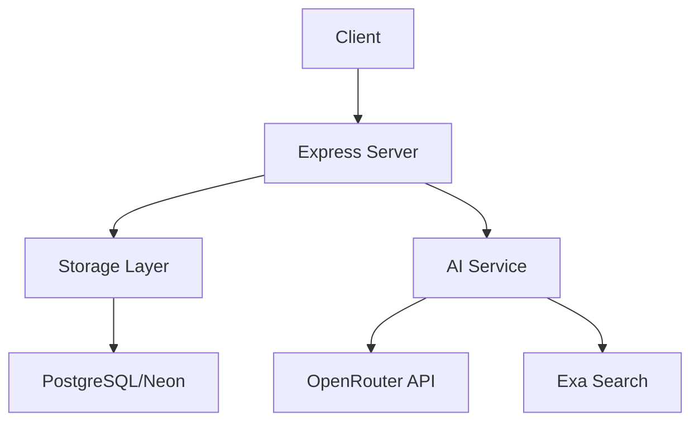
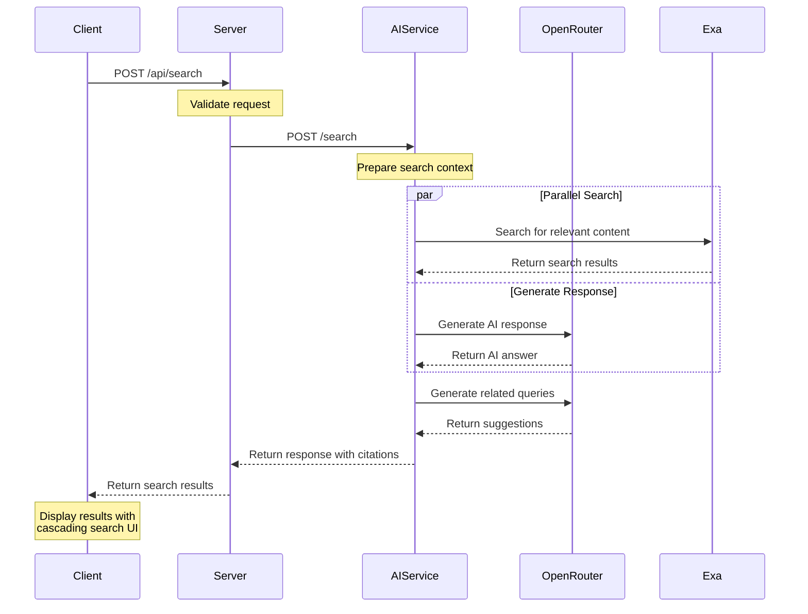
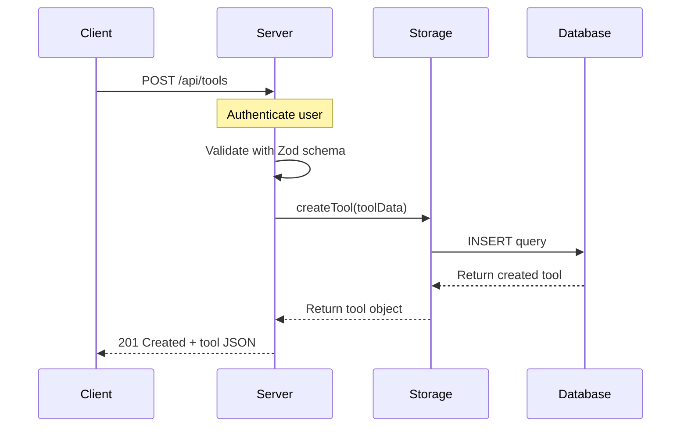

# Server Package

Node.js Express backend API for the Quantize platform.

## Overview

The server package provides the RESTful API for authentication, tool management, analytics, and integration with the AI service.

## Architecture



## API Endpoints

### Authentication

- `POST /api/auth/register` - Register a new user
- `POST /api/auth/login` - Login existing user

### Tools

- `GET /api/tools` - List all tools with optional filters
- `GET /api/tools/:id` - Get specific tool details
- `POST /api/tools` - Create new tool listing
- `PUT /api/tools/:id` - Update existing tool
- `DELETE /api/tools/:id` - Delete a tool

### Analytics

- `POST /api/tools/:id/click` - Record tool click
- `POST /api/tools/:id/view` - Record tool view
- `GET /api/analytics/tools/:id` - Get tool analytics

### Search

- `POST /api/search` - AI-powered search with suggestions

### Admin

- `GET /api/admin/tools` - List pending tools for approval
- `PUT /api/admin/tools/:id/approve` - Approve a tool
- `PUT /api/admin/tools/:id/reject` - Reject a tool

## API Call Flow

The following diagram illustrates the flow of an AI-powered search request:



### Typical API Request Flow



## File Structure

```
server/
├── index.ts          # Entry point, Express setup
├── routes.ts         # API route definitions
├── vite.ts           # Vite integration for dev/prod
├── storage.ts        # Storage interface
├── storage.memory.ts # In-memory storage implementation
├── db.ts             # Database configuration
└── README.md         # This file
```

## Key Components

### `index.ts`
The Express application entry point:
- Sets up middleware (JSON parsing, logging)
- Registers all routes
- Integrates Vite for development HMR
- Serves static files in production
- Starts HTTP server

### `routes.ts`
Defines all REST API endpoints:
- Input validation with Zod schemas
- Storage layer abstraction
- Error handling
- Integration with AI service

### `vite.ts`
Bridges Vite and Express:
- Development: Vite middleware for HMR
- Production: Static file serving
- HTML transformation

### `storage.ts` & `storage.memory.ts`
Storage layer abstraction:
- Swappable implementations (memory vs. database)
- Clean separation of concerns
- Easy testing

## Development

### Running Locally

```bash
# From project root
yarn dev
```

This starts the server with:
- Hot module reloading
- TypeScript compilation
- Vite integration for frontend

### Environment Variables

```env
NODE_ENV=development|production
PORT=3001
AI_SERVICE_URL=http://localhost:5002
```

### Adding New Routes

1. Define the route in `routes.ts`:
   ```typescript
   app.get("/api/new-endpoint", async (req, res) => {
     // Implementation
   });
   ```

2. Add validation with Zod if needed:
   ```typescript
   const schema = z.object({
     field: z.string()
   });
   const data = schema.parse(req.body);
   ```

3. Use the storage layer:
   ```typescript
   const result = await storage.someMethod(data);
   res.json(result);
   ```

## Integration with AI Service

The server communicates with the AI service for search functionality:

```typescript
const aiResponse = await fetch('http://localhost:5002/search', {
  method: 'POST',
  headers: { 'Content-Type': 'application/json' },
  body: JSON.stringify({ query, model })
});
```

Fallback behavior ensures the app works even if AI service is unavailable.

## Error Handling

Global error handler converts exceptions to JSON responses:

```typescript
app.use((err, req, res, next) => {
  const status = err.status || 500;
  const message = err.message || "Internal Server Error";
  res.status(status).json({ message });
});
```

## Health Checks

The server supports health checks for Docker and monitoring:

```typescript
app.get("/api/health", (req, res) => {
  res.json({ status: "healthy" });
});
```

## Production Deployment

### Build

```bash
yarn build
```

This creates:
- `dist/index.js` - Bundled server code
- `dist/public/` - Built client assets

### Run

```bash
NODE_ENV=production node dist/index.js
```

### Docker

```bash
docker build -f packages/server/Dockerfile -t quantize-server .
docker run -p 3001:3001 quantize-server
```

## Testing

```bash
# Type checking
yarn check

# Run tests (if available)
yarn test
```

## Performance Considerations

- **Caching**: Consider Redis for session/data caching
- **Database**: Connection pooling configured in `db.ts`
- **Static Assets**: Nginx recommended for production
- **Rate Limiting**: Consider adding for API endpoints

## Security

- Input validation with Zod
- SQL injection protection via parameterized queries
- CORS configured appropriately
- Environment variables for secrets
- Firebase Auth for authentication

## Contributing

When adding new features:
1. Follow existing patterns in `routes.ts`
2. Use Zod for validation
3. Leverage the storage abstraction
4. Add appropriate error handling
5. Update this documentation
